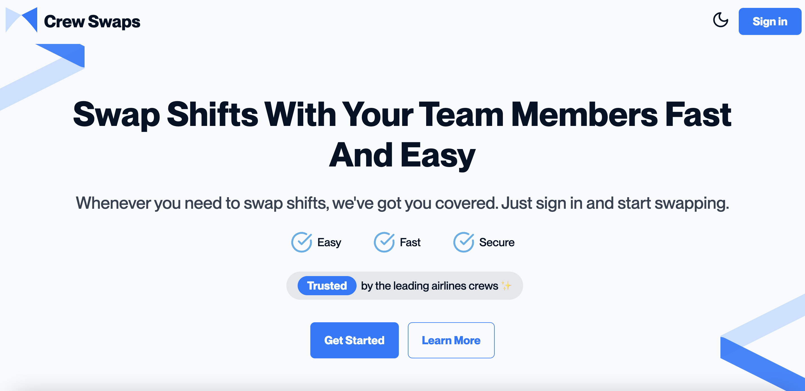
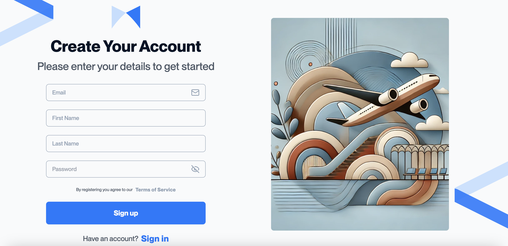
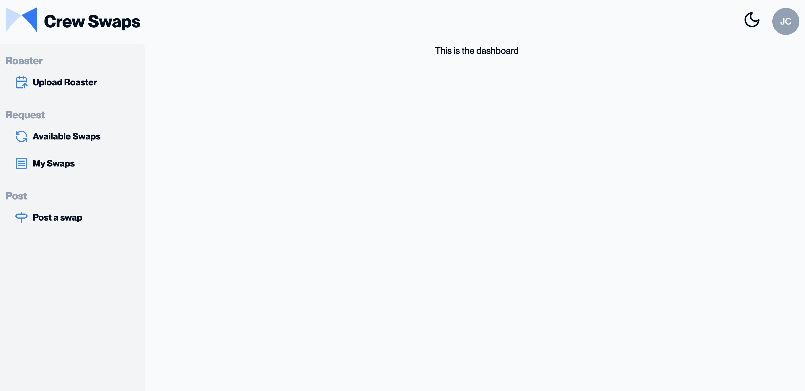
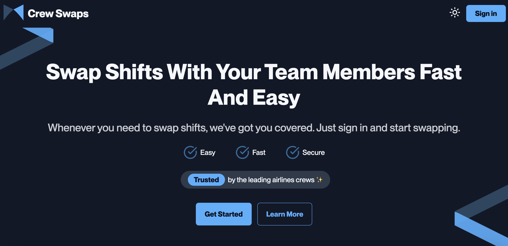
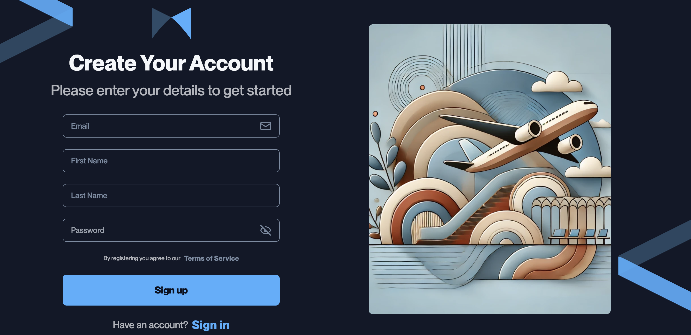
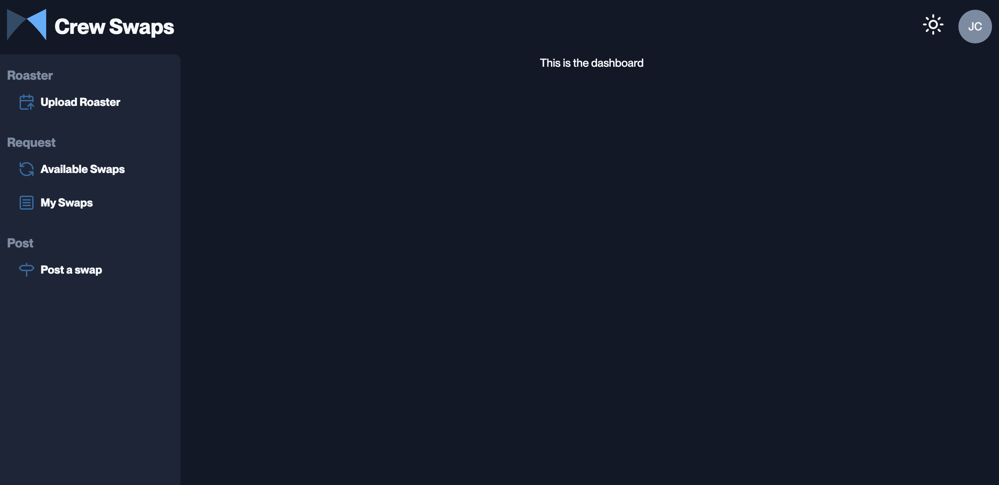

# Crew Swap

Crew Swap is an app designed for airline crew members to easily swap their rosters with colleagues. The app includes a landing page, sign-in and sign-up pages, and a dashboard layout with styles. It is built using React and Tailwind CSS.

### Dark Mode

